최근 사내에서 클라우드 3사 통합 빌링 시스템 개발에 참여하면서, Django 기반 웹앱 개발에도 참여했고 이를 Azure App Service 에 배포하는 것을 구성하기도 했습니다. 이 글에서는, 개발 초기에 앱 배포를 위해 인프라와 배포 파이프라인을 어떻게 구성했는지 살펴보고, 배포 파이프라인을 어떻게 개선해 왔는지에 대한 경험을 공유하고자 합니다.

# App Service 리소스 생성 및 구성
먼저 웹앱을 배포하려면 당연하게도 호스팅에 쓸 인프라 리소스가 필요합니다. 지난 번 ["ASP.NET앱 개발과 Azure 관리형 서비스로 배포하기 - 2. 관리형 서비스로 빠르게 구축하고 배포하기"](/2020/11/15/quick-aspnet-dev-azmanaged-deploy-part2)에서도 사용한 Azure App Service 를 앱 배포에 사용하기로 하였습니다. 이를 위해, 아래 사진과 같이, App Service 생성시 런타임 스택을 Python 3.8 로 지정 후 생성합니다. 
> 참고: [Application Insight 의 경우 .Net 기반 앱만 런타임에서 모니터링 하는것만 지원하므로.](https://docs.microsoft.com/ko-kr/azure/azure-monitor/app/app-insights-overview#get-started) Python 환경에서도 사용하려면 추후 별도 구성이 필요합니다.

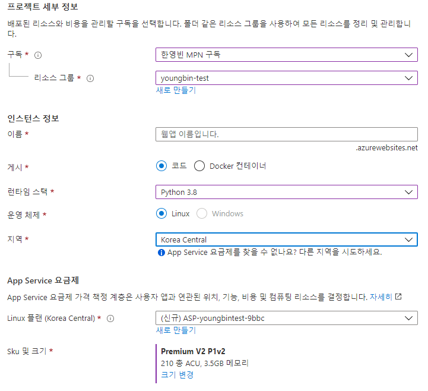

웹앱 배포를 하기 전, DB 연결정보, 암호화 키 정보, SendGrid(이메일 발송) 토큰 등을, Django `settings` 모듈에서는 환경변수에서 불러와서 설정하도록 합니다. 그리고 App Service 의 *구성* 화면의 *애플리케이션 설정*에서 해당 환경변수를 설정해 줍니다. 

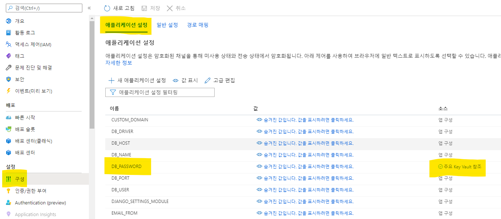

API 토큰, 암호화 키, DB 접속 암호 같이 평문으로 저장되면 안 되는 값은 Key Vault 에 저장한 후 이를 불러오도록 설정해야 합니다.
API 토큰이나 DB 접속 암호같이 문자열로 이뤄진 것은 *비밀* 화면에서 새로 생성하여 저장합니다.
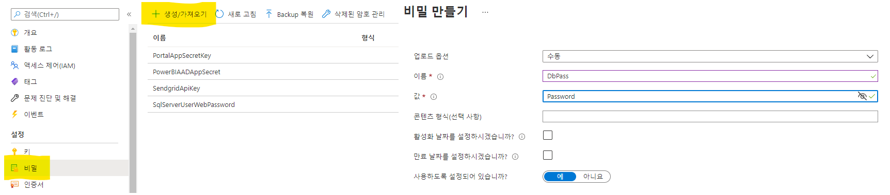

App Service 에서 Key Vault 에 접근할 수 있도록, 액세스 정책을 추가해 줍니다. 이를 위해 App Service 리소스의 ID 에서 *시스템 할당 항목* 을 켜서 Azure AD 에 등록되도록 하고, Key Vault 의 액세스 정책에서 찾아 추가합니다. 추가한 항목에는 *가져오기* 와 *나열* 권한을 부여합니다.
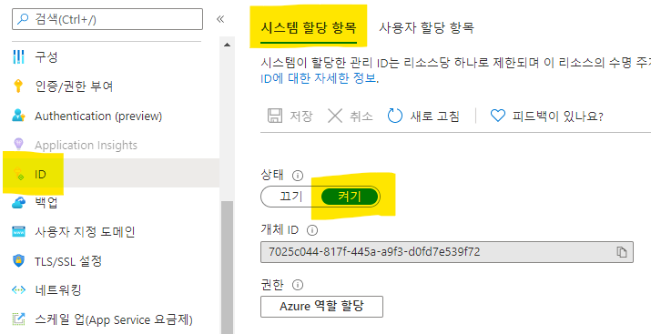
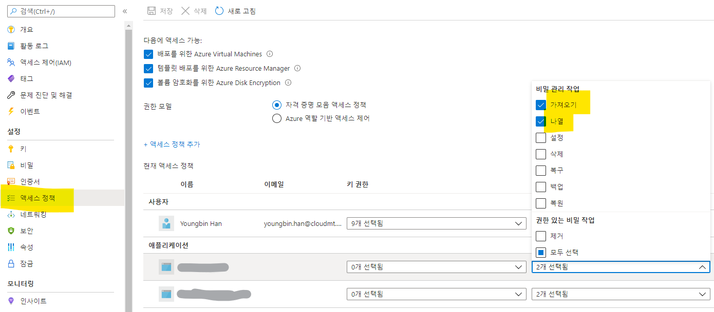

Key Vault 에 등록된 비밀의 상세 정보를 조회하면, `https://` 로 시작하는 비밀 식별자를 찾을 수 있습니다. 이 값을 이용해서 App Service 에서 비밀을 불러와서 사용할 수 있습니다. App Service 의 *애플리케이션 설정* 에 값 등록시 아래와 같은 형식의 값을 넣고 저장하면 됩니다.

```bash
@Microsoft.KeyVault(SecretUri=<비밀_식별자>)
# 예시
# @Microsoft.KeyVault(SecretUri=https://mysecret.vault.azure.net/secrets/DbPass/1234cff7f231420aa785e17a12345038)
```

# Azure DevOps에 Service Connection 설정 추가하기
Azure Pipelines 에서 Azure 리소스에 접근하려면, Service Connection 을 Azure DevOps 워크스페이스에 설정해서 둘을 연결해 주어야 합니다. 
보통 Service Connection 설정 시, Azure 구독에 대해 Service Principal 을 생성할 수 있는 권한이 있다면, Azure DevOps 에서 자동으로 연결을 설정할 수 있습니다.
하지만 그렇지 않은 경우도 많죠. 여기서는 SP(Service Principal) 을 수동을 생성하고, 이를 이용해 Service Connection 을 설정하는 방법을 알아보겠습니다.

## SP 생성 권한 유뮤 확인
먼저 SP 생성 권한이 있는지 Azure AD 및 Azure 구독에서 확인합니다.
1. Azure Portal 에서 Azure AD 로 이동한 후, *개요* 의 *로그인* 부분에서 본인의 **역할**을 확인합니다. *사용자* 역할인 경우, 관리자가 아닌 사람도 앱 등록이 가능한지 확인이 필요합니다.
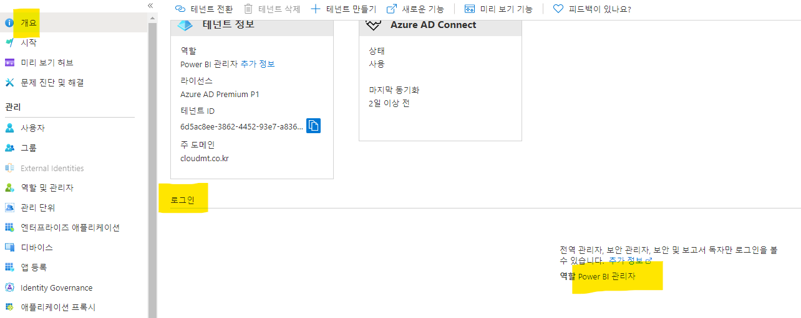
2. 관리자가 아닌 사용자도 앱 등록이 가능한지 확인하려면, *사용자 설정* 으로 이동하여, *앱 등록* 이 **예** 로 되어 있는지 확인합니다.
3. **아니오** 인 경우, 관리자 분께 문의하셔서 앱 등록(SP 발급)을 요청하셔야 합니다.
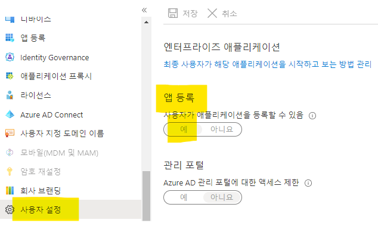

4. Azure 구독에서 권한이 있는지도 확인하기 위해, *구독* 화면에서 앞서 생성한 App Service 리소스가 사용하는 Azure 구독을 선택합니다.
5. *액세스 제어(IAM)* 에서 *내 액세스 보기* 를 클릭하여 할당된 역할을 확인합니다. 아래 사진처럼 **기여자** 로 되어 있으면, 앱 등록 생성이 불가능 합니다. 관리자분께 문의하여 [권한을 부여 받으시거나](https://docs.microsoft.com/ko-kr/azure/active-directory/roles/custom-available-permissions) 대신 SP를 생성해 달라고 요청하셔야 합니다.
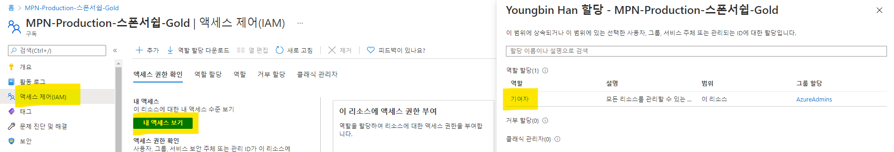
## 앱 등록(또는 Service Principal) 생성
앱 등록 권한이 있다면, 앱 등록을 직접 생성해서 Azure DevOps에 Service Connection을 생성할 수 있습니다. 
앱 등록을 생성하려면, Azure Portal 검색 바에서 *앱 등록* 을 검색하여 이동합니다. 이후, *새 등록* 을 클릭하여 새 앱 등록을 생성합니다.
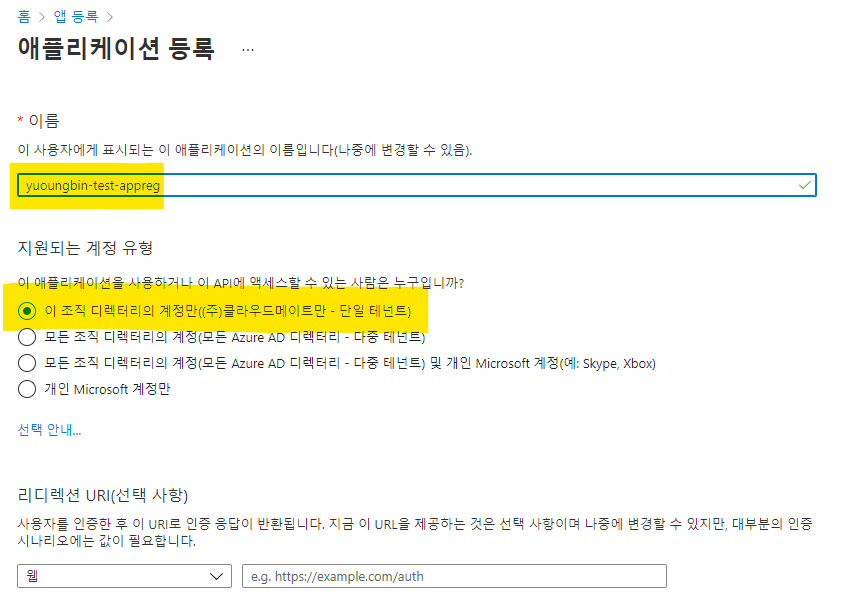

생성한 앱 등록이 Azure 구독 내 리소스에 접근할 수 있도록 역할을 할당해야 합니다. 앱 구독이 속한 Azure 구독의 관리 화면으로 이동하여, *액세스 제어(IAM) -> 역할 할당* 에서 *추가* 버튼을 클릭하여 새 역할 할당을 추가합니다. *기여자* 역할을 선택하고, 할당 대상 유형을 *사용자, 그룹 또는 서비스 주체* 로 선택합니다. *선택* 부분에서 앞에서 생성한 앱 등록을 검색하여 선택합니다. 그리고 *저장* 클릭하여 *앱 등록* 에 *기여자* 역할 할당을 완료합니다.
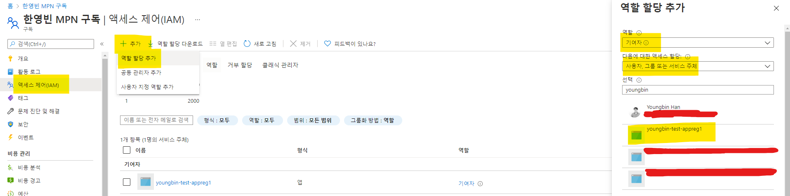

새로 생성한 앱 등록 리소스에서, *인증서 및 암호* 에서 *클라이언트 암호*를 새로 생성합니다. 여기서 생성한 클라이언트 암호를, Azure DevOps에 Service Connection 등록 시 사용합니다.
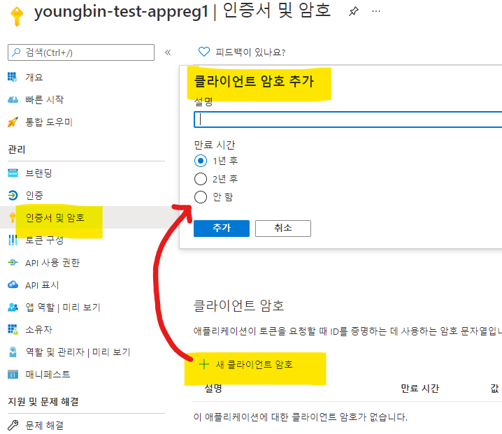

생성 완료 후, 아래와 같은 값을 복사해 둡니다.
- 클라이언트 암호
  - 생성한 클라이언트 암호의 **값**
- 앱 등록 개요에서 확인
  - 생성한 앱 등록의 **애플리케이션(클라이언트) ID**
  - 생성한 앱 등록의 **디렉터리(테넌트) ID**
- Azure 구독 정보
  - 앱 등록이 생성된 Azure 구독의 **구독 ID**
  - 앱 등록이 생성된 Azure 구독의 **구독 이름**

## Service Connection 생성
이제 앞에서 생성하여 복사해 둔 값을 이용하여, Azure DevOps Project에 Service Connection 을 생성하도록 하겠습니다.
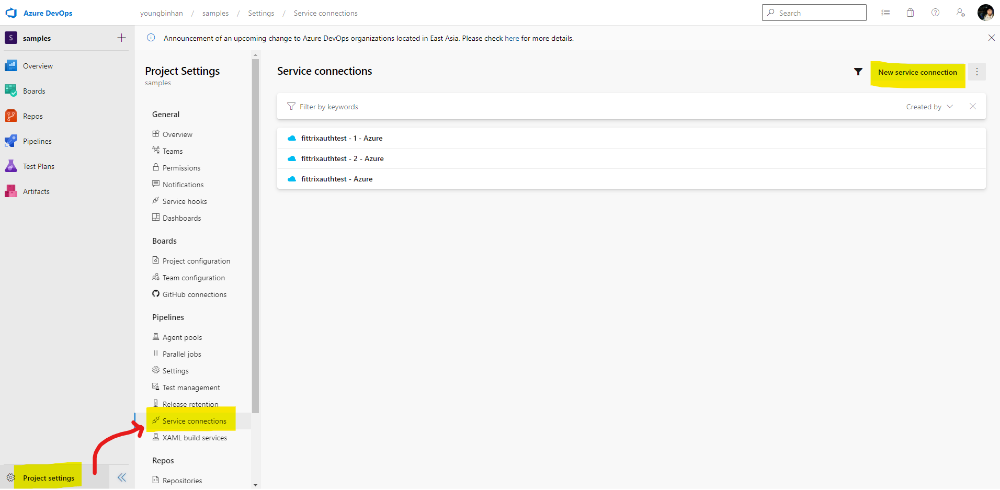
먼저 위 사진처럼, *Project settings* -> *Service connections* 화면으로 이동하여, **New service connection** 을 클릭합니다.

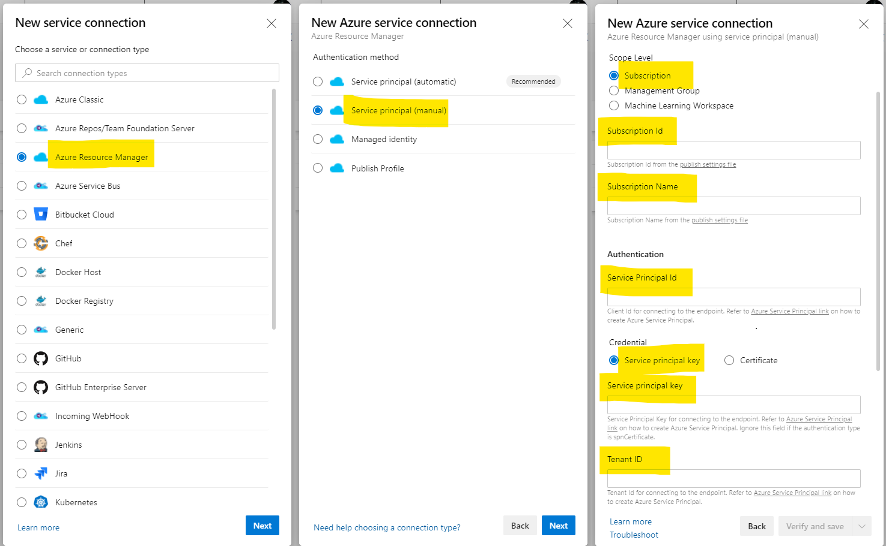
*Azure Resource Manager* 를 선택한 후, *Service principal(manual)* 을 선택하여, 앞에서 생성한 Service Principal 을 입력하여 진행하도록 합니다.
다음과 같이 Service connection 생성 양식을 입력합니다.

- Environment: *Azure Cloud* 선택
- Scope Level: *Subscription* 선택
- Subscription Id: 앞 단계에서 복사한 *앱 등록이 생성된 Azure 구독의 **구독 ID***
- Subscription Name: 앞 단계에서 복사한 *앱 등록이 생성된 Azure 구독의 **구독 이름***
- Service Principal Id: 앞 단계에서 복사한 *생성한 앱 등록의 **애플리케이션(클라이언트) ID***
- Credential: *Service principal key* 선택
- Service principal key: 앞 단계에서 복사한 *생성한 클라이언트 암호의 **값***
- Tenant ID: 앞 단계에서 복사한 *생성한 앱 등록의 **디렉터리(테넌트) ID***

입력 완료 후, *Verify* 버튼을 클릭하여, 입력한 설정값이 정상적으로 작동하는지 확인합니다. 
문제가 없다면, *Service connection name* 과 *Description (optional)* 을 마저 입력 후,
프로젝트 내 모든 파이프라인에서 접근하도록 하려면, *Grant access permission to all pipelines*를 체크한 후, *Verify and save*를 클릭하여 Service connection 생성을 마무리 합니다.

# Azure Pipelines - YAML Pipeline 구축하기
App Service 리소스 구성과 Service Connection 구성을 완료 했으니, 이제 이를 이용하여 Django 앱을 App Service 에 배포하는 파이프라인을 구축해 봅시다.
보통은 Azure DevOps의 Pipelines 화면에서 새 파이프라인 생성시 *Python to Linux Web App on Azure* 를 선택해서 진행하면 파이프라인 파일까지 자동을 생성해 주지만, 
그 과정에서 Service Connection 을 자동으로 생성하고 구성하기 때문에, 앞에서 설정한 Service Connection 을 선택하여 진행할 수 없으며, Azure 구독에 SP 생성 권한이 없으면 권한 부족 오류가 발생합니다.

때문에 파이프라인을 정의한 YAML 파일을 먼저 저장소에 커밋하고, 이를 이용하여 파이프라인을 구성해 보겠습니다.
아래 코드는 파이프라인 생성 시, *Python to Linux Web App on Azure* 선택하면 나오는 파이프라인 YAML 코드입니다. 
이 코드에서 다음과 같은 부분만 수정하여 `.pipelines/deploy-pipeline.yml`에 저장 후 커밋합니다.

- `azureServiceConnectionId`: 앞에서 생성한 Service Connection 의 이름을 입력합니다.
- `webAppName`: 앞에서 생성한 Azure App Service 리소스의 이름을 입력합니다.
- `environmentName`: 파이프라인 빌드 배포 환경을 정의합니다. 원하는 이름으로 입력하세요.

```yml
# Python to Linux Web App on Azure
# Build your Python project and deploy it to Azure as a Linux Web App.
# Change python version to one thats appropriate for your application.
# https://docs.microsoft.com/azure/devops/pipelines/languages/python

trigger:
- main

variables:
  # Azure Resource Manager connection created during pipeline creation
  azureServiceConnectionId: '<Service Connection Name>'

  # Web app name
  webAppName: '<Azure Web App Resource Name>'

  # Agent VM image name
  vmImageName: 'ubuntu-latest'

  # Environment name
  environmentName: '<Pipeline Environment Name>'

  # Project root folder. Point to the folder containing manage.py file.
  projectRoot: $(System.DefaultWorkingDirectory)

  # Python version: 3.8
  pythonVersion: '3.8'

stages:
- stage: Build
  displayName: Build stage
  jobs:
  - job: BuildJob
    pool:
      vmImage: $(vmImageName)
    steps:
    - task: UsePythonVersion@0
      inputs:
        versionSpec: '$(pythonVersion)'
      displayName: 'Use Python $(pythonVersion)'

    - script: |
        python -m venv antenv
        source antenv/bin/activate
        python -m pip install --upgrade pip
        pip install setup
        pip install -r requirements.txt
      workingDirectory: $(projectRoot)
      displayName: "Install requirements"

    - task: ArchiveFiles@2
      displayName: 'Archive files'
      inputs:
        rootFolderOrFile: '$(projectRoot)'
        includeRootFolder: false
        archiveType: zip
        archiveFile: $(Build.ArtifactStagingDirectory)/$(Build.BuildId).zip
        replaceExistingArchive: true

    - upload: $(Build.ArtifactStagingDirectory)/$(Build.BuildId).zip
      displayName: 'Upload package'
      artifact: drop

- stage: Deploy
  displayName: 'Deploy Web App'
  dependsOn: Build
  condition: succeeded()
  jobs:
  - deployment: DeploymentJob
    pool:
      vmImage: $(vmImageName)
    environment: $(environmentName)
    strategy:
      runOnce:
        deploy:
          steps:

          - task: UsePythonVersion@0
            inputs:
              versionSpec: '$(pythonVersion)'
            displayName: 'Use Python version'

          - task: AzureWebApp@1
            displayName: 'Deploy Azure Web App : $(webAppName)'
            inputs:
              azureSubscription: $(azureServiceConnectionId)
              appName: $(webAppName)
              package: $(Pipeline.Workspace)/drop/$(Build.BuildId).zip
```
저장한 YAML 파이프라인 파일로 파이프라인을 구성하려면, *Pipelines -> Pipelines -> New Pipeline(화면 우측 상단)* 을 클릭하여 아래와 같은 화면으로 들어갑니다. 
순서대로 *Azure Repos Git* -> 파이프라인 파일을 커밋한 저장소 -> *Existing Azure Pipelines YAML file* 를 선택하고, 파이프라인 파일을 커밋한 브랜치와 파일 경로를 입력합니다.
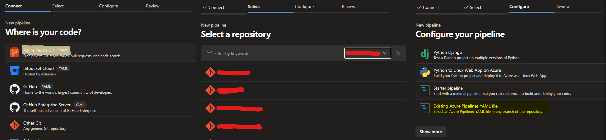

## YAML 파이프라인 기본 구조 살펴보기
파이프라인 파일 정보를 입력하고 다음 단계로 넘어가면 파이프라인 코드를 리뷰하는 화면이 나타납니다. 파이프라인 코드를 훝어보며 YAML 파이프라인의 기본 구조와, 파이프라인 구성에 사용한 코드에서 어떤 작업을 수행하는지 살펴보도록 하겠습니다. 

먼저 위 코드를 보면 크게 세 부분으로 나눠 볼 수 있습니다. 

- `trigger`: 파이프라인 실행 조건 지정(커밋 푸시 트리거)
- `variables`: 파이프라인에서 사용할 변수 설정
- `stages`, `jobs`, `steps`, 실행할 작업 정의

그 외에도 몇 가지가 더 있습니다.

- `name`: 빌드 넘버링 포맷 지정
- `resources`: 파이프라인 실행 시, 저장소에 포함된 파일과 파이프라인 변수 이외에 추가적으로 필요한 리소스 정의
- `pr`: Pull Request 트리거 지정
- `schedules`: 주기적으로 트리거 할 일정 지정

### `trigger`
커밋이 푸시되면 어떤 조건 하에서 트리거 되도록 할 지 조건을 지정할 수 있습니다.
브랜치, 태그, 변경된 파일 경로 등을 조건으로 설정할 수 있습니다.
```yaml
trigger:
  batch: boolean # true 로 설정시, 실행중인 빌드가 있으면 대기 했다가 대기 중 푸시된 커밋을 한번에 빌드합니다.
  branches:
    include: [ string ] # 빌드 트리거 할 브랜치
    exclude: [ string ] # 빌드 트리거에서 제외할 브랜치
  tags:
    include: [ string ] # 빌드 트리거 할 태그
    exclude: [ string ] # 빌드 트리거에서 제외할 태그
  paths:
    include: [ string ] # 빌드 트리거 할 파일 경로
    exclude: [ string ] # 빌드 트리거에서 제외할 파일 경로
```
### `variables`
이름 그대로, 파이프라인 실행 중 사용할 변수를 선언하는 곳 입니다.
파이프라인 전역에서 사용하도록 정의 할 수도 있고, 뒤에 나올 Stage, Job 단위에서 사용하도록 정의할 수도 있습니다.
```yaml
variables:
  var1: 123
  var2: 'hello'
  arr: [1, 2, 3]
```
### `stage`, `job`, `step`
여기에서 실제로 자동화 할 작업을 정의합니다. 가장 작은 단위인 `step`부터, 이를 묶은 `job`, 여러`job`을 논리적인 단위로 묶는 `stage` 까지 다양한 단계로 세분화하고 그룹화 할 수 있습니다. 
# 참고 자료
- [How to: Use the portal to create an Azure AD application and service principal that can access resources](https://docs.microsoft.com/en-us/azure/active-directory/develop/howto-create-service-principal-portal#app-registration-app-objects-and-service-principals)
